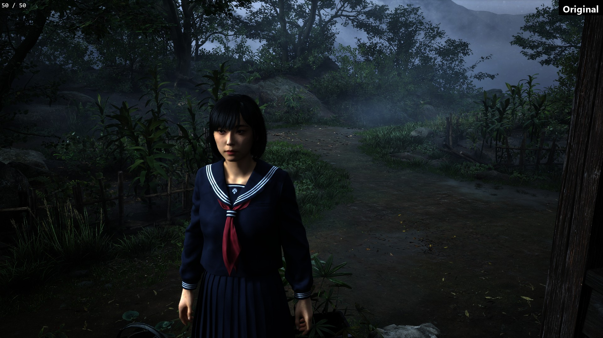
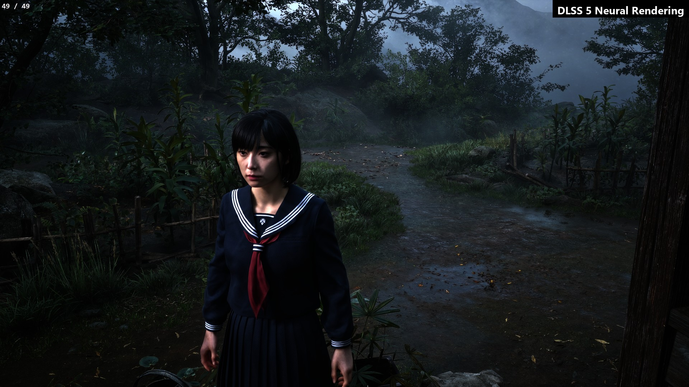

<p align="center"></p>

<p align="center"><b>Lossless Scaling, extended.</b><br>DLSS 5 Neural Rendering, DLSS, FSR and XeSS upscaling for games that never had them, and an addon manager that keeps it all in one window.</p>

<p align="center"></p>

**Addon Manager for Lossless Scaling** loads alongside [Lossless Scaling](https://store.steampowered.com/app/993090/Lossless_Scaling/) and gives it an addon system,
with four addons that do what Lossless Scaling alone cannot:

- **DLSS 5 Neural Rendering** gives any game a new look, on every frame Lossless Scaling shows.
- The **DLSS**, **FSR** and **XeSS Upscalers** put a real temporal upscaler in place of Lossless Scaling's NIS scaler, so games that never had one get one.

Around them, the manager installs and switches addons, shows the machine's load at a glance, explains what limits your frame rate, backs every setting up and
updates itself. It is free, MIT-licensed and unofficial: not affiliated with the Lossless Scaling developers. Read the [disclaimer](DISCLAIMER.md) before installing.

[](https://github.com/Echo-Storm/ls-addon-manager/actions/workflows/build.yml)
&nbsp; **0.9.23**, on the way to 1.0 ([roadmap](ROADMAP.md)) &nbsp;·&nbsp; Lossless Scaling 3.2.2.0 &nbsp;·&nbsp; Windows 10 or 11, x64

> [!TIP]
> **New in 0.9.23 and 0.9.22: HDR fixes.** With HDR on, sharpening could turn a highlight into a white speck (up to 10,000 nits) in all three upscalers (0.9.22), and the Catmull-Rom lean could ring around bright highlights (0.9.23): both fixed. Also in 0.9.22: Neural Rendering flickers less (its auto quality no longer ramps, its smoothing is steadier), **Sharpen less in fast motion** (0.5), and the FSR Upscaler sharpens like the others.
> **0.9.18:** the recorder is one setting for all the addons (switch it on in any panel).
> **0.9.17:** the upscalers start in about a second again (0.9.14 to 0.9.16 took nearly ten).
> **0.9.16:** the DLSS Upscaler starts with Neural Rendering on; the Performance tab works on AMD and Intel cards; the compatibility test
> uses the card Lossless Scaling runs on; and [what to do](docs/antivirus.md) when an antivirus flags the download.
> **0.9.15:** Neural Rendering in HDR without the neon orange and cyan in bright areas.
> **0.9.14:** the upscalers in motion, a very big improvement: much less trailing and smearing while you walk and turn, no flicker at the
> screen's own size with DLSS (the new **Auto** model), and all three now beat a plain stretch in a fast turn, for 3-4 ms a frame at 4K.
> Everything else is in the [changelog](CHANGELOG.md).

<p align="center"></p>
<p align="center"></p>
<p align="center"><sub>Silent Hill f (Unreal Engine 5, HDR) through Lossless Scaling: the original above, DLSS 5 Neural Rendering below.</sub></p>

> [!IMPORTANT]
> **DLSS 5 Neural Rendering needs a file you provide yourself:** your own copy of `nvngx_dlssnr.dll`. It is **not included**, this project **never downloads it**,
> and it does not say where to get it. Put it next to `LosslessScaling.exe` (Setup and the addon's **Browse for the model file...** button can copy it there), then
> press **Test compatibility** in the addon's panel. Everything else, the upscalers included, works without it.

**Tried with** World of Warcraft: Forever, Fallout: New Vegas (Tale of Two Wastelands), Silent Hill f (HDR) and Metro 2033 Redux, on an RTX 4070 Ti SUPER and
Windows 11. Other games and cards are untested so far: reports are welcome.

## Contents

- [Install](#install)
- [The addons](#the-addons): [Neural Rendering](#dlss-5-neural-rendering), [the upscalers](#the-upscalers-dlss-fsr-and-xess), [built-in features](#built-in-features)
- [The manager](#the-manager) · [Hotkeys](#hotkeys) · [Updates](#updates) · [If something goes wrong](#if-something-goes-wrong)
- [For developers](#for-developers): how it works, building, writing an addon · [Credits](#credits)

## Install

1. Download `LSAddonManager-<version>-x64.zip` from the [releases page](https://github.com/Echo-Storm/ls-addon-manager/releases) and unzip it.
2. Close Lossless Scaling and run **`LSAddonManagerSetup.exe`**. It finds your Lossless Scaling folder (Steam or not; otherwise choose **Use a different
   folder...**) and offers what fits: **Install**, **Update**, **Repair** or **Uninstall**.
3. Start Lossless Scaling. The manager opens by itself. Neural Rendering is on; the upscalers are off until you switch one on.

<table>
<tr>
<td valign="top" width="50%"><b>Setup, before installing</b><br></td>
<td valign="top" width="50%"><b>Setup, when it is done</b><br></td>
</tr>
</table>

**What Setup does:**
- Keeps Lossless Scaling's own `Lossless.dll` as `Lossless_original.dll` (the manager forwards to it) and puts ours in, with the `addons` folder.
- **Backs up everything it replaces** into a `backups` folder, checks every file after copying, and puts the folder back as it was if anything fails.
- **Never touches your settings** or your other addons, and refuses to run while Lossless Scaling runs from that folder.
- After a **Lossless Scaling update** (which may put its own `Lossless.dll` back), run it again: it offers **Repair**.
- Asks for administrator rights only when the folder needs them (Program Files, for example).

Like every file here, Setup is **unsigned**, so Windows SmartScreen may warn you: choose *More info*, then *Run anyway*. Its source is in [`installer/`](installer/).

<details>
<summary><b>Installing by hand</b></summary>

1. Close Lossless Scaling and open its folder (for Steam, for example `C:\Program Files (x86)\Steam\steamapps\common\Lossless Scaling`).
2. **First time only:** rename its `Lossless.dll` to `Lossless_original.dll`. Keep it: the manager forwards to it.
3. The files are inside Setup. In a command prompt in the unzipped folder, run `LSAddonManagerSetup.exe --extract files`: it writes them into a new
   `files` folder and changes nothing else. Copy everything from there (`Lossless.dll`, the two `manager-icon` files and `addons`) into the Lossless Scaling folder.
4. Start Lossless Scaling.

**Updating:** extract the new release's files the same way and copy them over the old ones. **After a Lossless Scaling update:** delete the stale
`Lossless_original.dll`, rename the new `Lossless.dll` to `Lossless_original.dll`, and copy ours in again. **Uninstalling:** delete our `Lossless.dll`, rename
`Lossless_original.dll` back to `Lossless.dll`, and delete `addons` if you like.
</details>

## The addons

| | What it does | Needs | Starts |
|---|---|---|---|
| **DLSS 5 Neural Rendering** | NVIDIA's neural rendering model on every frame Lossless Scaling shows: a new look for any game | NVIDIA RTX, your own model file | on |
| **DLSS Upscaler** | NVIDIA DLSS in place of NIS: upscaling, or DLAA at the screen's own size | NVIDIA RTX | off |
| **FSR Upscaler** | AMD FSR 3.1 or FSR 4 in the same place | any DirectX 12 card | off |
| **XeSS Upscaler** | Intel XeSS in the same place | any card with Shader Model 6.4 | off |

Every runtime the upscalers need comes with them. Only one upscaler runs at a time; any of them works beside Neural Rendering.

### DLSS 5 Neural Rendering

Runs NVIDIA's DLSS 5 neural model on Lossless Scaling's frames and puts the result on **every frame it presents, real and generated**, without ever making
Lossless Scaling wait.

- **Frame generation on or off.** With it on, the model's result is carried onto the generated frames along the motion; with it off, the model takes the presented frames.
- **Its own motion measurement**, per pixel, so the picture holds together while the camera turns.
- **Looks:** saved sets of sliders, a look per game that follows the game in focus, and a hotkey to cycle them.
- **Keep the HUD untouched:** draw the areas the model must leave alone (action bars, chat, the minimap) on a snapshot of the game.
- **Picture controls:** intensity, fine detail, local contrast, skin detail, sharpening, tone, colour, shadows and highlights, film grain, temporal smoothing,
  and a ghost guard where the motion cannot be trusted.
- **HDR games** (scRGB and HDR10), with only the model's change put back, so highlights keep their brightness.
- **Compare while you play:** before / after, a split view, and before / after pictures (see [Hotkeys](#hotkeys)).
- **Auto quality** keeps the model within a time budget; a **compatibility test** tries the model on your card before you play.

About 5 to 9 ms a frame on an RTX 4070 Ti SUPER with a 1912x1080 model input (8.5 ms at 4K in World of Warcraft). [The addon's README](addons/DLSS5NR01/README.md) has the details.

<p align="center"></p>

### The upscalers: DLSS, FSR and XeSS

<p align="center"></p>

Lossless Scaling scales a game window up to the screen one frame at a time. The upscalers put a **temporal upscaler** in its place: it reads several frames and
the motion between them, for a steadier picture with cleaner, smoother edges. The game needs no support for it: **the addons measure the motion from the frames themselves.**
What it cannot do is add detail the game did not render: a game gives its own upscaler a tiny camera shift every frame, which is where a temporal upscaler finds extra
detail, and Lossless Scaling's frames carry none. Measured on recordings (`docs/frame-generation-research.md`): where the picture moves the addons lean on a resample of the
frame (no trailing), and at rest the upscaler smooths (the **Sharpness at rest** slider trades some of that back for sharpness).

**To use one:** switch it on in the addon list, choose **NIS** as the Scaling Type in Lossless Scaling, and run the game in a window smaller than the screen
(for example 2560x1440 on a 4K screen). At the screen's own size it anti-aliases instead.

| | DLSS | FSR | XeSS |
|---|---|---|---|
| Runs on | NVIDIA RTX | any DirectX 12 card | any card with Shader Model 6.4 (Intel Arc, NVIDIA, AMD) |
| Versions | **Auto** (the default: model E at the screen's own size, L when upscaling), or K, L, J (DLSS 4), M (DLSS 4.5), E (DLSS 3) | FSR 3.1.4 (AMD's, signed) or FSR 4.1.1b (the OptiScaler team's build, on any card) | XeSS 2.0.2 (Intel's, signed) |
| Good at | smoothing edges | FSR 3: low cost, crisp text; FSR 4: motion | on Intel Arc it runs on the card's matrix units |
| Sharpening | ours | AMD's RCAS, ours above it | ours |

**Which one?** On an NVIDIA RTX card, try DLSS and FSR 4. On any other card, FSR, and XeSS on Intel Arc. All three are tried in World of Warcraft.

What all three do:
- **Every presented frame**, real and generated, with frame generation on or off.
- **HDR games** (scRGB and HDR10) in the upscaler's own HDR mode, highlights kept; *Frame encoding* overrides the automatic choice.
- **4:3 and other window shapes**, upscaled into the part of the screen Lossless Scaling uses, borders left alone.
- **Steady in fast motion:** Lossless Scaling gives an upscaler none of the camera jitter a game gives it, so in motion its memory of
  earlier frames only trails; where the picture moves, ours leans on the new frame (**Lean from** sets from how much motion).
- **Stability** (less shimmer on wires and leaves), **edge smoothing** for games without anti-aliasing, and **sharpening** well past the upscaler's own.
- **Colour and tone** (vibrance, saturation, shadows, highlights, brightness, contrast, gamma), applied before upscaling, so they cost nothing.
- **Settings per game**, which come back when the game takes focus.
- **Before / after** against NIS while you play, and a line of live numbers.

What they cost on an RTX 4070 Ti SUPER, everything included (the 1:1 row: 0.9.14, live in World of Warcraft, the motion estimate included):

| | DLSS | FSR 3.1 | XeSS |
|---|---|---|---|
| 1920x1080 -> 3840x2160 | | about 1.5 ms | not measured yet |
| 2560x1440 -> 3840x2160 | about 2.4 ms | about 1.85 ms | not measured yet |
| 3840x2160 at 1:1 (anti-aliasing) | about 4.2 ms (model E) | about 3.3-3.7 ms | about 2.7-2.8 ms |

FSR 4 costs more than FSR 3.1; the panel's status line shows what it takes on your card. If the game has its own anti-aliasing (MSAA), switch it on: it
draws what no upscaler can put back. The [upscalers' guide](addons/DLSS5NR01/docs/upscalers.md) covers every setting.

### Built-in features

Built into the manager, on its Features tab, both off until switched on:

- **ReShade input passthrough:** mouse and keyboard reach a ReShade overlay while Lossless Scaling scales the game. **Home** turns it on and off.
- **Windowed mode and second monitor:** a virtual display the size of your game window, so Lossless Scaling works with a windowed game or on a second
  monitor, with split-screen and side-by-side options. Switching it on needs a restart of Lossless Scaling.

## The manager

- **The machine at a glance:** the header shows the graphics card's load and memory, system memory and the processor, on every tab.
- **A Performance tab that explains itself:** frame rate and frame times, what each addon costs, the GPU's load, power, clocks, temperature and memory, and a
  plain-words reading such as "the GPU is at its power limit".
- **Addons without touching folders:** install from a folder, a zip or a DLL (or drop one on the window); *Remove* moves an addon aside, nothing is erased.
- **Runtimes list:** every file the addons run on (DLSS, FSR, XeSS, your model) with its version, whether it is loaded, and whether it is signed as its maker
  shipped it. **+** switches to another file while the game runs.
  <p align="center"></p>
- **Record a bug:** an addon keeps the last few seconds of frames and saves them as a file that plays the problem back on another computer.
- **Stays out of the way:** it opens with Lossless Scaling, hides to the notification area, and comes back with a click or **Ctrl+Shift+F12**.
- **Back up and restore** every setting to one file, and a **diagnostics zip** of logs and settings for a bug report (nothing is uploaded).
- **Safe by design:** a faulting addon cannot take Lossless Scaling down, settings are written atomically, and optional SHA-256 checks guard addon DLLs.
- **Interface size** from 75% to 200%, sharp on any display.

| Tab | What is on it |
|-----|--------------|
| **Addons** | The addon list with a switch, icon and live status for each, the Runtimes list, and the chosen addon's settings |
| **Features** | ReShade input passthrough and Windowed mode |
| **Performance** | Frame times, addon cost, GPU load, power, clocks, temperature, memory, and what is limiting you |
| **Settings** | Backup and restore, interface size, start-up and hotkey, updates, security, log detail, the diagnostics file |
| **Logs** | The last 10,000 log entries, filtered by level |
| **About** | What comes with it, version and updates, credits |

Closing the window stops nothing: the manager hides to the notification area (Windows may keep its icon under the ^ arrow by the clock).

<table>
<tr>
<td valign="top" width="50%"><b>Performance</b><br></td>
<td valign="top" width="50%"><b>Settings</b><br></td>
</tr>
</table>

## Hotkeys

They work while the game has focus. The game sees the key too, so the defaults keep away from keys games often use alone (F5, F6, F9, F11). If one
clashes in your game, change it in the addon's *Compare and hotkeys* section.

| Keys | What they do | Where |
|------|--------------|-------|
| Ctrl+Shift+F12 | Show or hide the manager | the manager |
| Ctrl+Shift+F7 | Before / after: the original (or NIS) against ours | every addon |
| Ctrl+Shift+F8 | Split view: the original at the left, ours at the right | Neural Rendering |
| Ctrl+Shift+F2 / F3 | Sharpening down / up | every addon |
| Ctrl+Shift+F4 | Before / after pictures: two PNGs of the same moment, with and without the addon | every addon |
| Ctrl+Shift+F10 | The next saved look | Neural Rendering |
| Ctrl+Shift+F1 | Save the recording (the last few seconds, with *Recording* on in any addon: it is one setting) | every addon |
| Home | ReShade input passthrough on and off | the manager |

## Updates

Once a day the manager asks GitHub whether there is a newer release (**on by default**; *Settings > Updates* turns it off, *Check now* always works). When
there is, it asks once:

- **Download and install** downloads the release, checks its size and SHA-256 against GitHub's and that the Setup inside is that version, then updates when
  you close Lossless Scaling and starts it again. Your settings carry over.
- **Not now** asks again after the next check; **Don't ask again for this release** waits for a newer one (the About tab still offers it).

That check, and a download you ask for, are the only times the manager goes online. To update by hand, download the zip and run Setup: it offers **Update**.

## If something goes wrong

| What you see | What to do |
|--------------|-----------|
| The manager does not appear | It may be hidden: look under the ^ arrow by the clock, or press Ctrl+Shift+F12. If not, a Lossless Scaling update may have put its own `Lossless.dll` back: run Setup and choose **Repair**. |
| Setup says Lossless Scaling is running | Close it (also from its notification-area icon), then press **Check again**. |
| Setup does not find your Lossless Scaling folder | Choose **Use a different folder...** and pick the folder that holds `LosslessScaling.exe`. Setup remembers it. |
| SmartScreen or your antivirus objects to a file, or flags the zip as a trojan | The files are not signed, and a new unsigned file that replaces a DLL looks suspicious to a cloud check; it is a false positive. [What to do](docs/antivirus.md): compare the SHA-256 on the release page, build it yourself, or allow it. If your antivirus removes `nr_selftest.exe`, only *Test compatibility* stops working. |
| Neural Rendering says the model file is missing | It needs your own `nvngx_dlssnr.dll` next to `LosslessScaling.exe`: use **Browse for the model file...**, then **Test compatibility**. |
| An upscaler is on but the picture looks like NIS | Choose **NIS** as the Scaling Type in Lossless Scaling. The panel's status line says what the upscaler is doing. |
| The DLSS Upscaler names a card that is not NVIDIA's | Lossless Scaling runs on that card. Set its **Preferred GPU** to your NVIDIA card, or use the FSR or XeSS Upscaler, which run on any card. |
| FSR 4 looks wrong, costs too much or does not start | Set *FSR version* back to **FSR 3.1.4** in the FSR Upscaler's panel. A chosen file that goes missing falls back to the shipped one by itself. |
| An addon says its runtime "stopped responding" | Lossless Scaling carries on without the addon. Choose another runtime with **+** in the Runtimes list, restart Lossless Scaling, and send us the addon's log. |
| An HDR game looks washed out, too dark or too bright | Set **Frame encoding** (the bottom of the Upscaling section) to HDR or SDR by hand, and tell us which it needed. |
| Neural Rendering turns bright areas neon orange or cyan in HDR | Fixed in 0.9.15: update. |
| Windowed mode does nothing | Restart Lossless Scaling after switching it on: its virtual display must exist before Lossless Scaling starts. |
| Something looks wrong in a game | Turn on *Recording* in any addon's panel (one setting for all), make it happen, press **Ctrl+Shift+F1**, and attach the `.lsrec` file (in `Videos\Lossless Scaling`) to your report. |
| Anything else | See the [questions and answers](docs/faq.md). To report a bug, make a **diagnostics file** on the Settings tab. To undo everything, run Setup and choose **Uninstall**. |

<details>
<summary><b>The files it keeps</b></summary>

All inside the Lossless Scaling folder, except the recordings.

| File | What |
|------|------|
| `addons\config.json` | Every addon's state and settings, and the manager's. Written atomically; an unreadable one is kept as `config.json.corrupt`. |
| `addons\trusted_addons.json` | Optional: `{ "<addon id>": ["<sha256 of its DLL>"] }`, for the Security setting. |
| `addons\.removed\` | Addons you removed, each in a folder with a timestamp. |
| `addons\<addon>\runtimes\` | Runtime files added with **+** in the Runtimes list (and the FSR 4 build), one folder each. Updates leave them alone. |
| `backups\` | What Setup replaced, and settings saved before a restore replaced them. |
| `logs\` | `LSAddonManager.log` and each addon's own (`DLSS5NR01.log`, `DLSS4DLAA.log`, `FSR3UPSC.log`, `XESSUPSC.log`); the manager's rolls over to `.old` at 8 MB. |
| `Videos\Lossless Scaling\*.lsrec` | Recordings, in your Videos folder. |
</details>

## For developers

### How it works

```
LosslessScaling.exe
  └─ loads Lossless.dll          <- the manager, in the original's place
       ├─ loads Lossless_original.dll (the real engine) and forwards its exports untouched
       ├─ watches Direct3D 11 compute work and shader loading, for addons that ask
       ├─ loads the addons from addons\
       └─ draws its window with Dear ImGui on its own thread
```

Nothing in Lossless Scaling is patched on disk, and removing the manager puts everything back. Addons share the manager's Dear ImGui context, so their
settings appear inline in the same look.

The addons do their GPU work on a Direct3D 12 device of their own, beside Lossless Scaling's Direct3D 11 one; they share textures and fences, every wait
between them is a GPU wait, and NVIDIA's, AMD's and Intel's code runs on a thread of the addon's own, so Lossless Scaling's render thread never stops for
an addon. Neural Rendering hooks the frame Lossless Scaling captures or presents; the upscalers recognise its NIS pass and put their picture in its output.
The [architecture notes](addons/DLSS5NR01/docs/architecture.md) have more.

### Building

Visual Studio 2022 (Desktop C++) and CMake 3.20+. Dear ImGui and MinHook are fetched at pinned versions on first configure.

```powershell
powershell -File tools\build_all.ps1              # the manager and the addons (-Only host: the manager only)
powershell -File tools\run_addon_tests.ps1        # the offline tests for what changed (-All: everything, as before a release)
powershell -File tools\ci.ps1                     # what the GitHub build runs: manager, installer, sample addon, and the tests that need no GPU
powershell -File tools\package.ps1                # the release zip, with Setup built around the files
powershell -File tools\deploy.ps1 -What all       # copy a build into a Lossless Scaling folder, with backups
```

The addons also need their vendors' SDKs, which are not in this repository. Each script fetches from the vendor's own repository and checks what it gets:

| Script | What | Licence |
|--------|------|---------|
| `tools\fetch_ngx_sdk.ps1` | NVIDIA's DLSS SDK (headers, static library, `nvngx_dlss.dll`), after you accept NVIDIA's licence | NVIDIA's |
| `tools\fetch_ffx_sdk.ps1` | AMD's FidelityFX runtime, FSR 3.1.4 (pinned SHA-256, AMD's signature); the headers are in `third_party/ffx` | MIT |
| `tools\fetch_fsr4.ps1` | FSR 4.1.1b, the OptiScaler team's build (pinned SHA-256; needs 7-Zip) | AMD's FidelityFX SDK licence |
| `tools\fetch_xess_sdk.ps1` | Intel's XeSS SDK 3.0.2 (headers, `libxess.dll`; pinned SHA-256s, Intel's signature) | Intel Simplified Software License |

The offline test host and its scenarios (`tools\run_hosttest_matrix.py`) exercise every addon path without Lossless Scaling or a game. The
[tools README](tools/README.md) lists every script.

### Writing an addon

**Addons written for LosslessProxy load unchanged:** the interface began as LosslessProxy's and has only grown at the end. An addon with a settings panel
should still be rebuilt against this SDK (`manager/sdk/include/eam`), since the manager pins its own Dear ImGui; if a panel faults anyway, the manager
switches that panel off instead of going down with it.

Start from the [sample addon](examples/SampleAddon), a small, tested addon with settings, a panel, a status line and a metric. Then read
[docs/addon-authors.md](docs/addon-authors.md) for the exports, the host interface and the shared look, and [docs/api-compatibility.md](docs/api-compatibility.md)
for what the 1.0 interface promises.

## Credits

This project began as [LosslessProxy](https://github.com/FrankBarretta/LosslessProxy) by **FrankBarretta**, with thanks: its proxy `Lossless.dll` with addons,
its addon interface and the ReShade and Windowed features. The manager has since been rewritten; about a tenth of its lines still match the original's.
Neural Rendering began as **andreiday**'s DLSS 5 plugin for LosslessProxy and has been rewritten and extended here.

The upscalers run NVIDIA DLSS, AMD FidelityFX Super Resolution (FSR 4 as built by the OptiScaler team, with thanks) and Intel XeSS; their motion measurement,
stability and edge smoothing are this project's own. The full list, with licences, is in [NOTICE.md](NOTICE.md). NVIDIA, DLSS, AMD, FidelityFX, FSR, Intel and
XeSS are trademarks of their owners; this project is not affiliated with or endorsed by them. Lossless Scaling belongs to its author; this project is unofficial.

If it is useful to you, you can [support it on Ko-fi](https://ko-fi.com/xechostormx).

[MIT licence](LICENSE) · [Changelog](CHANGELOG.md) · [Roadmap](ROADMAP.md) · [Questions and answers](docs/faq.md)
